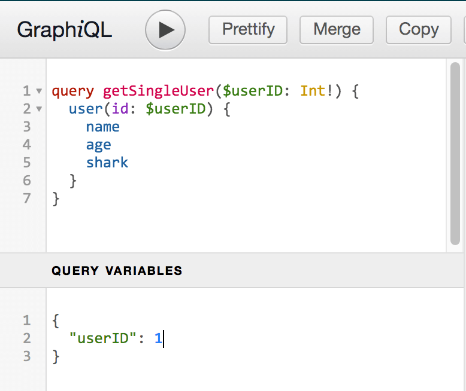

# GraphQL setup in Nodejs

install package:
```
npm install graphql express express-graphql -S
```
with `express-graphql@^0.12.0`

the usage is
```javascript
const { graphqlHTTP } = require('express-graphql');
const { buildSchema } = require('graphql');
```

## Step of using GraphQL
### 1. Define a Schema

doc link: https://docs.github.com/en/graphql/guides/introduction-to-graphql#schema

The Schema manages queries and mutations, defining what is allowed to be executed in the GraphQL server. A schema defines a GraphQL API’s type system. It describes the complete set of possible data (objects, fields, relationships, etc.) that a client can access.

In JavaScript, you need to use `buildSchema` to build a Schema object from GraphQL schema language.
```javascript
const schema = buildSchema(`
    type User {
        id: Int
        name: String!
        age: Int
    }
`);
```
#### Constructing Types
You can also define types inside `buildSchema`, in most cases are `Query` and `Mutation`. `Query` is an object holding the functions that will be mapped to GraphQL queries, used to fetch data. While `Mutation` holds functions that will be mapped to mutations, used to create, update or delete data.
Example:
```javascript
// Initialize a GraphQL schema
var schema = buildSchema(`
  type Query {
    user(id: Int!): Person
    users(shark: String): [Person]
  },
  type Person {
    id: Int
    name: String
    age: Int
    shark: String
  }
`);
```
in the Query object, `users` return type is `[Person]`, mean return an array of type `Person`. The `!` in `user(id: Int!)` means that the id must be provied. `users` query takes an optional `shark` variable.


### 2. Defining Resolvers
A resolver is responsible for mapping the operation to an actual function. Inside `type Query`, you have an operation called `users`. You map this operation to a function with the same name inside root.
You’ll also create some sample `users` for this functionality.
Example:
```javascript
// Sample users
const users = [
  {
    id: 1,
    name: 'Brian',
    age: '21',
    shark: 'Great White Shark'
  },
  {
    id: 2,
    name: 'Kim',
    age: '22',
    shark: 'Whale Shark'
  },
  {
    id: 3,
    name: 'Faith',
    age: '23',
    shark: 'Hammerhead Shark'
  },
  {
    id: 4,
    name: 'Joseph',
    age: '23',
    shark: 'Tiger Shark'
  },
  {
    id: 5,
    name: 'Joy',
    age: '25',
    shark: 'Hammerhead Shark'
  }
];

// Return a single user by Id
const getUser = function(args) {
    const userID = args.id;
    return users.filter((user) => (user.id == userID))[0];
}

// Return a list of users (takes an optional shark parameter)
const retrieveUsers = function(args) {
    if (args.shark) {
        const shark = args.shark;
        return users.filter(user => user.shark === shark);
    } else {
        return users;
    }
}

// Root resolver
const root = {
  user: getUser,  // Resolver function to return user with specific id
  users: retrieveUsers
};
```
In the web interface, you can try:



You will receive the following output:
```javascript
{
  "data": {
    "user": {
      "name": "Brian",
      "age": 21,
      "shark": "Great White Shark"
    }
  }
}
```

### 3. Defining Aliases
if you want to query multiple `users`, you can't directly query for the same field with different arguments. Instead, you need to make an aliases for each field.
Example:
```javascript
query getUsersWithAliases($userAID: Int!, $userBID: Int!) {
  userA: user(id: $userAID) {
    name
    age
    shark
  },
  userB: user(id: $userBID) {
    name
    age
    shark
  }
}
```
'userA' and 'userB' are the aliases, and the variables could be
```javascript
{
  "userAID": 1,
  "userBID": 2
}
```
the result you will receive will be:
```javascript
{
  "data": {
    "userA": {
      "name": "Brian",
      "age": 21,
      "shark": "Great White Shark"
    },
    "userB": {
      "name": "Kim",
      "age": 22,
      "shark": "Whale Shark"
    }
  }
}
```

